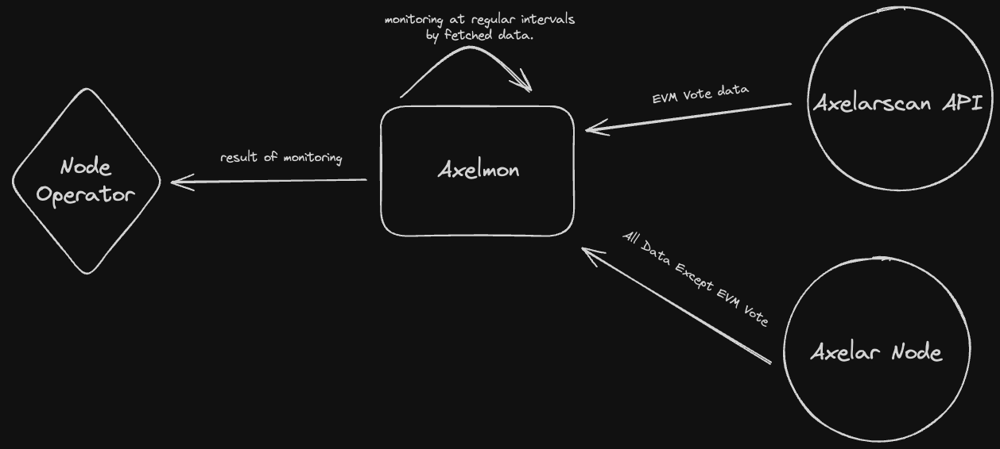

# Axelmon

`Axelmon` is a monitoring tool designed specifically for validators on the Axelar network. 
With `Axelmon`, validators can effortlessly verify the health and performance of both `vald` and `tofnd` nodes.
If you are operating `amplifier`, you could monitor ampd also through specifying `target_svcs` as `["vm"]`. 
Additionally, this tool promptly alerts operators in case any issues arise with these nodes.

### Contents

- [Axelmon](#axelmon)
  - [Monitoring List](#monitoring-list)
  - [Features](#features)
  - [Quick Guide](#quick-guide)
- [Deep dive](#deep-dive)
  - [Background](#background)
  - [What does it do?](#what-does-it-do)

## Monitoring List

- Heartbeat
  - Monitors `vald` node sent properly `heartbeat tx` to the Axelar network when `heartbeat event` emitted.
- Maintainer
  - Monitors the registration status of maintainers on the Axelar network.
- EVM Vote
  - Monitors votes for registered external chains(Maintainers).
- VM Vote
  - Monitors votes for amplifier.

## Features

- JSON API
  - Access monitoring results via a JSON API, available at the following path: `/`.
- Prometheus
  - Also support Prometheus for providing monitoring results. You can access them at the following path: `/metrics`.
- Alerts
  - You could alert to operator with supported Alerts options.

### Supported Alerts
You could receive alerts via followings if any issues arise with your node.

```toml
[alerts]
resend_duration = "24h"
[alerts.telegram]
enable = true
token = "xxxxxxxx:xxxxxxxxxxxxxxxx"
chat_id = "xxxxxxxxxx"
mentions = ["@<userId(eg. @hello)>"]

[alerts.slack]
enable = true
webhook = "<webHook-url>"
mentions = ["<userId(eg. U05QL6EDDQE)>"]

```

## Quick Guide

1. Build

```bash
go build
```

2. Configure `config.toml` file

```bash
cp config.toml.example config.toml
```

1. Run

```bash
./axelmon -config config.toml
```

## config.toml
```toml
[general]
# mainnet || testnet
# it determine what axelarscan api used to. if the network you would monitor is not mainnet/testnet, you could set this value as you want.
#
# mainnet: "https://api.axelarscan.io:443"
# testnet: "https://testnet.api.axelarscan.io:443"
#
# others(like devnet): "<if you set network as "https://devnet-verifiers.api.axelarscan.io:443", it'll be used as api server>"
#
network = "mainnet"

# Program execution period (minutes)
# it runs to monitor axelar and sleeps for a while you entered period.
period = 60

# In axelar, there is associated account with validator that called as proxy account(it's on your tofnd). and this proxy account is used for externalChainVotes.
# + you should set this field as accAddress, not valAddress(valops)
#
# but if you set this field with non-validator account, and cannot find any proxy account, it'll just use entered account.
# reason why the program uses account which is not proxy when cannot fetch proxy account is for amplifier(verifier).
# because amplifier doesn't use any proxy account, just uses its own account.

validator_acc = "axelar123..."

# Chains you don't want to monitor.
# If empty, all external votes will be monitored.
# e.g. "aurora, ethereum"
except_chains = ""

rpc = "https://axelar-rpc...:443"
api = "https://axelar-api...:443"

grpc = "axelar-grpc...:443"
grpc_secure_connection = true

listen_port = 8080

target_svcs = ["maintainer", "heartbeat", "evm"]

[alerts]
# when program detects over-threshold situation, it'll call alert func, and if there is already exists with same message before, alert func will be completed.
# this feature is designed to prevent too many alerts with same sitatuion (or already proceed solving action but not applied to network).
# 
# but if program alerts, and operator forget it, node will be keep unhealthy state.
# 
# to prevent this accident, program will send alerts if there is no alert record, 
# or alert record which already exists is over than `resend_duration`.  
resend_duration = "24h"

[alerts.telegram]
enable = true
token = "xxxxxxxx:xxxxxxxxxxxxxxxx"
chat_id = "xxxxxxxxxx"
mentions = ["@<userId(eg. @hello)>"]

[alerts.slack]
enable = true
webhook = "<webHook-url>"
mentions = ["<userId(eg. U05QL6EDDQE)>"]


[heartbeat]
# The number of heartbeats you want to check.
check_n = 3

# If a heartbeat is missed for more than miss_cnt, an alarm will triggered.
miss_cnt = 	2

[external_chain_vote] # external_chain_vote configurations are used to check evm/vm polls.

# The number of votes for each external chain events you want to check.
check_n = 10

# this field restrict monitor target period. some chains connected on mainnet/testnet may have low txs.
# and if votes contain too old vote records when I fetch votes with number of `check_n`, and also invalid vote txs are exists before, monitoring alert may be less trusted.
#
# `check_period_days` will truncate old records.
check_period_days = 10

# If a `missedVotes / totalVotes` is over `miss_percentage` parameter, it'll alert.
miss_percentage = 20

```


# Deep dive

## Background

Axelar network is a chain that mainly services bridge, and it is important for validator teams to operate nodes.

Axelar network validators will run following nodes:

- `axelard`
  - This is the main component that communicates with other nodes via P2P and secures the network’s consensus via Tendermint BFT.
  - Axelar network itself is preparing sign batches that can be relayed to appropriate EVM compatible chains.
- `vald`
  - It listens to events from the Axelar network, such as signing requests, and verifying events on EVM chains. It’s connected to EVM compatible RPC nodes of external chains, where it queries for events such as deposit confirmations and message send.
  - On one side it is connected to the Axelar network, where it reads instructions what to verify. On the other side, it’s connected to EVM compatible RPC nodes of external chains, where it verifies that batches were executed correctly from Axelar network.
- `tofnd`
  - gRPC service which wraps rust implementation of multi-party signing protocols, such as, ECDSA multisig, GG20 threshold-ECDSA protocol (t of n), into RPC calls invoked by vald.Signs transaction batches for sending to smartcontracts on destination chains
  - It has to be executed in highly secured environment.

The bridge service of Axelar network relies on the `vald` and `tofnd` nodes. Any issues with these nodes can significantly impact quality and security. Swift problem recognition is crucial to avoid disruptions. Once an issue is identified, operators investigate by analyzing logs and collaborating with other validator teams or the Foundation on Discord.

This is why we developed `Axelmon`, which helps us for swiftly recognize issues with the `vald` and `tofnd` nodes.

## **What does it do?**



`Axelmon` is a monitoring tool designed to oversee nodes related to bridge service of Axelar network. Let’s delve into what `Axelmon` monitors:

- Heartbeat
  - Heartbeat events emit at regular intervals, specifically when $CurrentHeight \mod 50 == 0$.
  - Within 1-2 blocks from this event emitted height, the validator’s **`vald`** node must send a `heartbeat transaction` to the Axelar network.
  - `Axelmon` monitors the miss count for `n` heartbeats.
- Maintainer
  - The Maintainer is the external chains that have chosen to support on the Axelar network.
  - It could be automatically deregistered, if a validator misses many votes.
  - `Axelmon` monitors whether the maintainer is registered or not.
- EVM Vote
  - Whenever a bridge service-related transaction occurs for a registered external chain, a vote is cast.
  - `Axelmon` monitors the miss count for n votes at each registered chains.

And `Axelmon` provide the result of monitoring:

- JSON API ( `localhost:${LISTENPORT}/` )

  ```json
  {
    "maintainers": {
      "status": true,
      "maintainer": {
        "Avalanche": true,
        "Ethereum": true
      }
    },
    "heartbeat": {
      "status": true,
      "missed": "0 / 3"
    },
    "EVMVotes": {
      "chain": {
        "Avalanche": {
          "status": true,
          "missed": "0 / 10"
        },
        "Ethereum": {
          "status": true,
          "missed": "0 / 10"
        }
      }
    }
  }
  ```

  - maintainers
    - status: If any of the mainainers are deregistered, the state will be `false`.
    - maintainer: `true` if registered, `false` if deregistered.
  - heartbeat
    - status: `false` if it is gte to the threshold filled in `miss_cnt` field of `config.toml`.
    - missed: Miss count for heartbeats.
      - (`miss_cnt` field) / (`check_n` field) in `config.toml`.
  - EVMVotes
    - status: `false` if it is gte to the threshold filled in `miss_cnt` field of `config.toml`.
    - missed: Miss count for votes.
      - (`miss_cnt` field) / (`check_n` field) in `config.toml`.

- Prometheus ( `localhost:${LISTENPORT}/metrics` )
  ```
  # HELP evm_votes_total Number of EVM votes
  # TYPE evm_votes_total counter
  evm_votes_total{network_name="Avalanche",status="missed"} 0
  evm_votes_total{network_name="Avalanche",status="success"} 10
  # HELP heartbeats_total Heartbeat of the application
  # TYPE heartbeats_total counter
  heartbeats_total{status="missed"} 0
  heartbeats_total{status="success"} 3
  # HELP maintainers_status_list Maintainer's status, 1 is active, 0 is not active
  # TYPE maintainers_status_list gauge
  maintainers_status_list{network_name="Avalanche"} 1
  ```
- Notification through Telegram
  - The alert condition corresponds to the condition for `false` status in the API.
